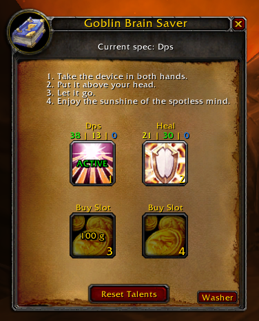

# Goblin Brain Saver - Turtle WoW 1.12 Addon

## Description:
Goblin Brain Saver is a World of Warcraft 1.12 addon that allows you to save, restore, and organize your talent specializations. It integrates seamlessly with the game UI using a custom Spellbook-inspired window.

## Features:
- Save your talent builds (per specialization).
- Quickly restore any saved build.
- Edit the name and icon of each specialization.
- Right-click context menu for additional options.
- Popups for renaming, deleting, or editing builds.

## Installation:
1. Unzip the archive into the following folder:  
   `World of Warcraft\Interface\AddOns\GoblinBrainSaver\`

## Author:
Gondoleon 
Inspired by [BrainSaver](https://github.com/MarcelineVQ/BrainSaver) by [MarcelineVQ](https://github.com/MarcelineVQ)

## Contact:
For suggestions or feedback:  
- Discord: Gondoleon

## Credits:
- Blizzard Entertainment for the original UI API.  
- The Turtle WoW community.  
- "Eternal Sunshine of the Spotless Mind" for poetic inspiration.

---

# Goblin Brain Saver - Turtle WoW 1.12 Addon

## Description :
Goblin Brain Saver est un addon World of Warcraft 1.12 permettant de sauvegarder, restaurer et organiser vos spécialisations de talents. Il s'intègre à l'interface du jeu via une fenêtre inspirée du Spellbook.

## Fonctionnalités :
- Sauvegarde des builds de talents (par spécialisation).
- Restauration rapide d'un build enregistré.
- Édition du nom et de l'icône de chaque spécialisation.
- Menu contextuel accessible via clic droit.
- Popups pour renommer, supprimer ou modifier un build.

## Installation :
1. Décompressez l'archive dans le dossier :  
   `World of Warcraft\Interface\AddOns\GoblinBrainSaver\`

## Auteur :
Gondoleon
Inspiré par [BrainSaver](https://github.com/MarcelineVQ/BrainSaver) de [MarcelineVQ](https://github.com/MarcelineVQ)

## Contact :
Pour suggestions ou retours :  
- Discord : Gondoleon

## Remerciements :
- Blizzard Entertainment pour l’API UI originale.  
- La communauté Turtle WoW.  
- "Eternal Sunshine of the Spotless Mind" pour l'inspiration poétique.
